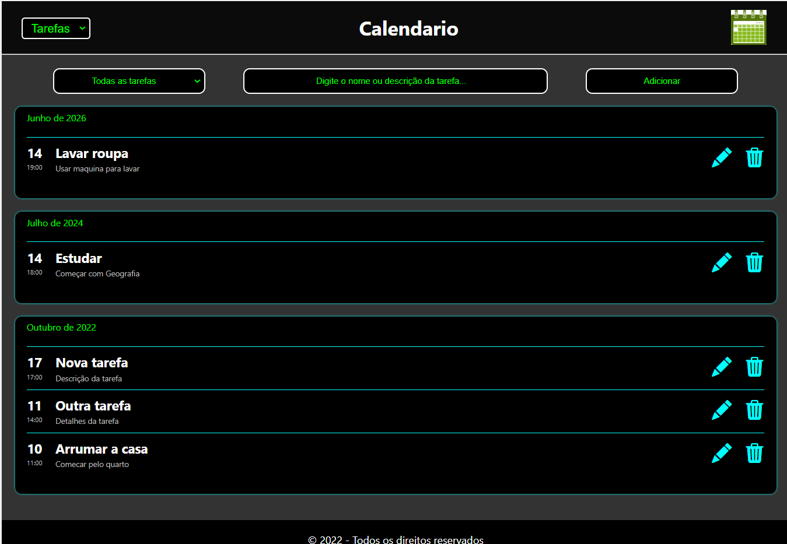
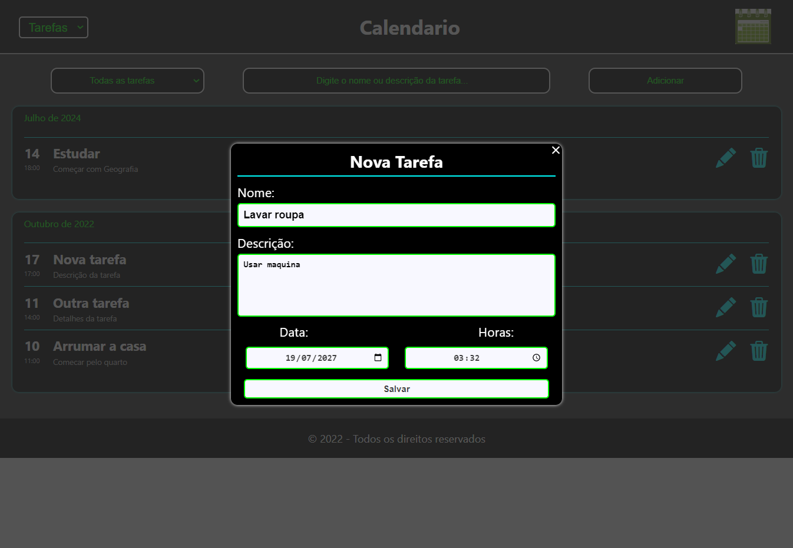
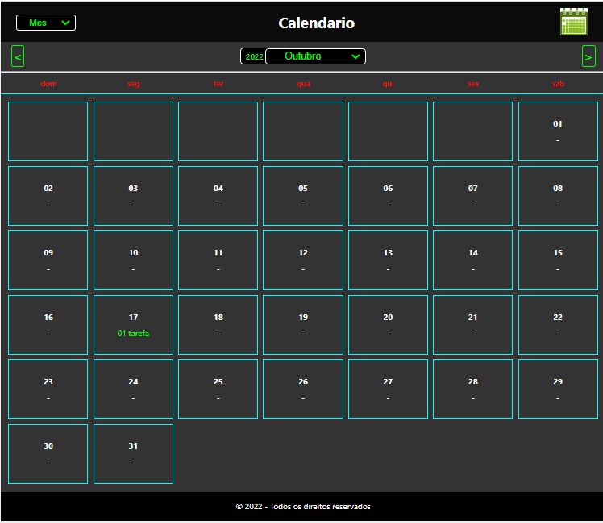
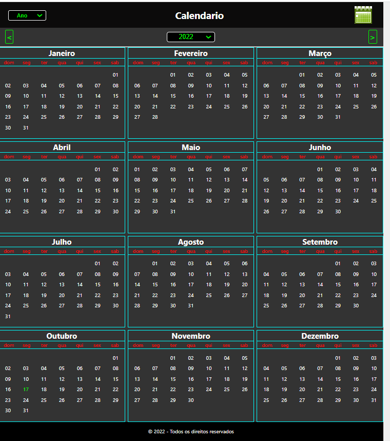

<h1 align="center"> Calendario React </h1>

 Olá pessoal! Fiz esse projeto utilizando os conhecimentos em React que adquiri. React é uma biblioteca front-end JavaScript incrivel de codigo aberto para a criação de interefaces. 

Aplicação conta com uma páginas para visualização de Ano, Mês, Semana, Dia e Tarefas

## Nesse projeto utilizei:
* Html Semantico
* Componentes em React
* FlexBox
* Grid
* Responsividade (min-350px)
* Media Screen
* 1030 linha de codigos css
* Designer Proprio
* Designer Dark
* Tarefas salvas em local storare do navegador, permanecendo mesmo com a atualização da página
* Interface facil e leve de usar

 

* Veja o video de como usar a aplicação:
https://leandros8w.github.io/projeto-calendario-react/prints/video-demostrativo.mp4

* Url da página para acesso:
https://leandros8w.github.io/projeto-calendario-react/

 

 
 

